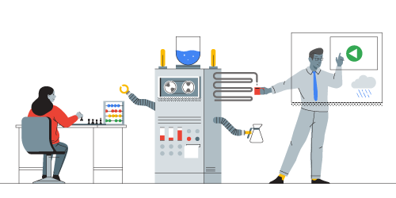

# Machine Learning <small>for intelligent ERP systems</small>

!!! todo
    Improve the introduction

Traditional accounting involve a lot of manual data processing, when we use the computers to do the processing for us, we need to input that data correctly into the computer systems.
Currently this means a lot of manual work, at least as long as many invoices and other important documents are not designed to be directly readable by machines.

This is where the VML team and our products come in. We are teaching computers to extract meaningful structured data from the unstructured data meant for humans - whether it be pictures of invoices or how to group bank entries when doing bank reconciliation.

{: .center}

By applying machines to automate previously manual processes, we can free up time to let employees better support customers, improve processes, and otherwise run the business better.

## The VML Team

!!! todo
    Write a short presentation of us

We have two main products, Smartscan and Autosuggest.

## Smartscan

Smartscan is a document scanning service, you can submit certain types of documents, which our systems then process, and in the end returns values from.
Such as from invoices, where our systems extract text and finds the most likely pieces of text that hold important numbers for invoices such as:

- The total cost including/excluding VAT
- The company that issued the invoice
- The issue date
- The due date

The docs for the Smartscan product is located [here](smartscan.md)

## Autosuggest

Autosuggest is a series of smaller APIs that each provide very specialized functionality.

### Models

- [Electronic Invoice Line](autosuggest#electronic-invoice-line)
- [Bank Entry](autosuggest#bank-entries)
- [Scanned Invoice](autosuggest#scanned-invoice)
- [Product Info](autosuggest#product-info)
- [Supplier Name](autosuggest#supplier-name)
